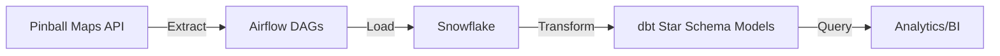
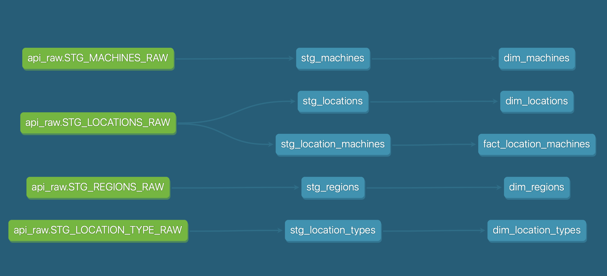

# Pinball Maps Batch Data Pipeline


A modern **batch-oriented data pipeline** that extracts **API data** from [Pinball Maps](https://pinballmap.com/map). The pipeline orchestrates workflows with **Apache Airflow**, transforms data into a **star schema with dbt**, and loads the results into **Snowflake** for analytics.  

The goal is to demonstrate end-to-end **batch data engineering skills**: API integration, workflow orchestration, transformation modeling (fact + dimension), cloud data warehouse integration, and containerized deployment.

---

## 📐 Architecture



---

## ✅ Features

- **Batch ingestion** from the Pinball Maps API  
- **Workflow orchestration** with Apache Airflow  
- **Cloud warehouse integration** with Snowflake  
- **Transformations** with dbt (star schema: fact + dimension tables)  
- **Containerized deployment** with Docker Compose  
- **End-to-end orchestration**: extract → load → transform → query  

---

## ⚡ Tech Stack
- **Python** (Airflow DAGs & API integration)  
- **Apache Airflow** (workflow orchestration)  
- **dbt (dbt-core, dbt-snowflake)** (data transformation & star schema)  
- **Snowflake** (cloud data warehouse)  
- **Docker & docker-compose** (containerized deployment)  

---

## 📦 Prerequisites

- **Docker Desktop** (or Docker Engine + Compose) installed and running  
- **Python 3.11+** installed locally  
- A valid **Snowflake account** (for warehouse integration) 

---

## 📂 Project Structure
```
.
├── dags/                    # Airflow DAGs
│   ├── pinball_maps_api_data.py
│   ├── pinball_maps_locations.py
│   └── snowflake_connection_test.py
├── dbt/                     # dbt project files
│   ├── dbt_project.yml
│   ├── profiles.yml
│   └── models/
│       ├── staging/
│       ├── marts/
│       │   ├── fact_pinball_games.sql
│       │   └── dim_locations.sql
├── config/                  # Airflow config
├── docker-compose.yml
├── Dockerfile
├── requirements.txt
└── .env.example             # Environment variables template
```

---

## 🛠 Setup

### 1. Clone repo & setup environment
```bash
git clone https://github.com/yourusername/batch-pipeline.git
cd batch-pipeline
cp .env.example .env   # update with your Snowflake credentials
```

### 2. Start services with Docker
```bash
docker compose up --build -d
```

### 3. Access the Airflow UI
Once containers are running, the Airflow UI is available at:
👉 [http://localhost:8080](http://localhost:8080)

Login credentials (set in `docker-compose.yml`):
- **Username:** airflow
- **Password:** airflow  

From the UI, you can trigger DAGs such as:
- `dynamic_api_machines` → extracts machine data from the Pinball Maps API into Snowflake  
- `dynamic_api_regions` → extracts region data from the Pinball Maps API into Snowflake  
- `dynamic_api_location_types` → extracts location type data from the Pinball Maps API into Snowflake  
- `pinball_maps_locations` → loads and transforms location data into Snowflake

---

### 4. Run dbt Models
dbt is installed inside the Airflow containers (not on your host machine).
To run dbt commands, execute them inside the `airflow-apiserver` service: 

```bash
# Run dbt models
docker compose exec airflow-apiserver bash -c "cd dbt && dbt run"

# Run dbt tests
docker compose exec airflow-apiserver bash -c "cd dbt && dbt test"
```

---

## 🗂 Schema & Lineage

The dbt models transform raw Pinball Maps API data into a **star schema** for analytics.



*dbt lineage graph showing the transformation flow from raw API tables → staging models → 
final fact (`fact_location_machines`) and dimension tables (`dim_machines`, `dim_locations`, 
`dim_regions`, `dim_location_types`) — together forming a star schema.*


## 🔎 Example Queries

```sql
-- Top locations with most pinball machines
SELECT location_name, COUNT(machine_id) as machine_count
FROM analytics.fact_pinball_games g
JOIN analytics.dim_locations l
  ON g.location_id = l.location_id
GROUP BY location_name
ORDER BY machine_count DESC
LIMIT 10;
```

```sql
-- Average number of machines per city
SELECT city, AVG(machine_count) as avg_machines
FROM analytics.dim_locations
GROUP BY city
ORDER BY avg_machines DESC;
```

---

## 🧹 Tear Down (Cleanup)
When you’re done, stop all containers:

```bash
docker compose down

# If you want to remove all volumes (database + logs)
docker compose down --volumes --remove-orphans
```

## 🔮 Next Steps

- Add automated testing and data quality checks
- Implement CI/CD for dbt models
- Expand API coverage to additional endpoints

---

📫 Connect with me: [LinkedIn](https://www.linkedin.com/in/wes-martin/) | [GitHub Portfolio](https://github.com/WesJM/data-engineering-portfolio)
